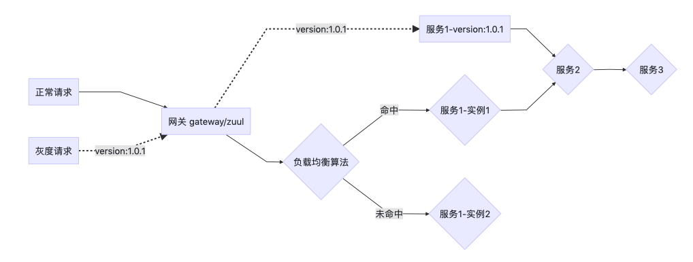

## [DEMO项目地址：https://github.com/labidc/labidc-gray-deploy-demo](https://github.com/labidc/labidc-gray-deploy-demo).
# labidc-gray-deploy 
##### spring cloud 非侵入式轻量级灰度发布插件
##### 基于spring-boot-starter-parent 2.0.7.RELEASE开发
#### 前言
##### 本来该插件设想是非暴力修改，扩展方式重写 LoadBalancerRule 相关负载均衡器规则，但发现会有并发问题，所以这里暴力重写了LoadBalancerRule 相关类，以后时间允许的情况下再做调整与修改（不忘初心）
##### 该文档使用了 mermaid 规范制作了流程图，如果需要查看流程图，请在ide里安装mermaid插件再预览，vscode有mermaid插件
##### 该灰度发布组件也可以用做测试环境多版本微服务并行测试使用。


## 开始
##### 1. 该插件开发了两个版本 分别支持 consul 和 eureka 两种注册中心。
##### 2. demo项目也对其有分别的实现与配置，分别实现了 zuul 和 gateway 两个网关案例。
##### 3. 但这里还是要详细说明一下使用方法，防止掉坑
## 注意：有可能出现的坑，该插件已经测试通过 【调用链】，【熔断器】没有测试过， 还有就是上传文件未测，长链接未测，可能会有坑, 欢迎测试。

### 实现原理：
1. 一般我们微服务调用是多层级的，比如 


2. 这个时候，如果我们整个链条下的某个服务开发了新版本需要灰度发布，但是其他服务是正式版本, 比如 服务1 有个灰度版本需要上线


3. 如果我们 服务2 有灰度版本，如下


4. 或者所有服务都有灰度版本


5. 基本原理介绍完了，说一下细节，上面流程图中，服务3，没有调用下层服务了，相当于他是最底层服务【叶级服务】。
所以这个层级的服务，只需要设置 标识就行了，标注他是不是灰度服务，同时标注他的版本号, consul和eureka 设置方法不同。
同时不需要安装插件

6. 对于服务2，服务1 整个调用链中间的服务，同样需要适应上面第5条，如果是灰度服务就需要标注灰度版本，同时需要安装插件。

7. 由于 gateway 基于 netty+webflux，和zuul 核心原理不同，zuul 基于 Servlet 容器, 可以直接使用。但是gateway 有一个专属版本，以自己实现一个过滤器实现。

8. 重点：核心原则，服务如果没有加入【版本标识】，该插件会识别成正式服务，如果有【版本标识】该插件会识别成灰度服务。
但是【正常请求】，如果访问下层服务没有正式服务，只有灰度服务的时候，不会调用，会报告异常，也就是说，整个调用链条所有服务必须要有正式服务，
当【灰度请求】，如果访问下层服务，下层服务有对应版本的灰度服务，会调用；如果没有对应版本的灰度服务，会调用正式版本服务，这样也就做到了
调用链当中部分【服务灰度发布的需求】
### 这个符合逻辑的，连正式版本都没有，哪来灰度版本呢。


9. 如何发起【灰度请求】呢，前端程序请求的时候，增加一个自定义头 version, 自定义头内容为版本号，这里的版本号会对应上面【第5条】提到
服务版本标识。注意哟，请求头的版本号要和服务的版本标识完全对应上哟，不然无法识别，会调用正式服务去，再啰嗦一句，正式服务不要加版本识


## 开始安装
    相关负载均衡规则请使用 com.labidc.gray.deploy.ribbon.rules 下的实现 跟官方一一对应    
    默认是 com.labidc.gray.deploy.ribbon.rules.GrayDeployZoneAvoidanceRule  
    如果有自己实现的规则请修改 setLoadBalancer 的 loadBalancer 为 com.labidc.gray.deploy.ribbon.GrayDeployILoadBalancerWrapper

### 一、网关：gateway，注册中心：consul ，以上面讲的案例为例子。

1. 添加tag
```yaml
spring:
   cloud: 
     consul: 
       discovery:
         tags:
           - version=1.0.1
```
2. maven添加依赖
#### labidc-gray-deploy-consul
```xml
  <dependency>
    <groupId>com.labidc</groupId>
    <artifactId>labidc-gray-deploy-consul</artifactId>
    <version>${labidc-gray-deploy.version}</version>
  </dependency>
  
  <dependency>
      <groupId>org.springframework.cloud</groupId>
      <artifactId>spring-cloud-starter-consul-discovery</artifactId>
  </dependency>

```

3. 【网关】, gateway, 由于gateway 基与webflux 使用Netty 作为容器, 所有有个专门为gateway实现的一个插件（注意该插件以来了consul,如果需要和eureka配合使用，请自行修改源码）, 其他配置方法一样
##### labidc-gray-deploy-gateway
```xml
    <dependency>
        <groupId>com.labidc</groupId>
        <artifactId>labidc-gray-deploy-gateway</artifactId>
        <version>${labidc-gray-deploy.version}</version>
   </dependency>
   
   <dependency>
       <groupId>org.springframework.cloud</groupId>
       <artifactId>spring-cloud-starter-consul-discovery</artifactId>
   </dependency>
```
```yaml
spring:
  cloud: 
   gateway:
      discovery:
        locator:
          enabled: true
      routes:
      - id: gray_demo
        uri: lb://product-service-demo3
        predicates:
        - Path=/test_service/**
        filters:
          - StripPrefix=1
          - name: Hystrix
            args:
              name: fallbackcmd
              fallbackUri: forward:/fallback
```

### 二、网关：zuul2，注册中心：eureka ，以上面讲的案例为例子。
1. 添加元数据map
```yaml
eureka:
  instance:
    metadata-map:
      version: 1.0.0
```
2. maven添加依赖
#### labidc-gray-deploy-eureka 
```xml
  <dependency>
      <groupId>com.labidc</groupId>
      <artifactId>labidc-gray-deploy-eureka</artifactId>
      <version>${labidc-gray-deploy.version}</version>
  </dependency>
  
  <dependency>
      <groupId>org.springframework.cloud</groupId>
      <artifactId>spring-cloud-starter-netflix-eureka-client</artifactId>
  </dependency>


```
3. 【网关】zuul2 
```yaml
# 路由规则配置
zuul:
  #忽略所有默认服务配置
  ignored-services: "*"
  routes:
    product-provider:
      # 这个设置非常关键，要手动设置敏感的请求header, 否则所有请求头都会被过滤，这样设置
      # 主要是为了放行version请求头
      sensitive-headers: Cookie,Set-Cookie,Authorization
      # 路由请求前缀 gray_service
      path: /gray_service/**
      # 取消掉gray_service 访问到后端服务
      stripPrefix: true
      serviceId: product-service-demo1 
```
添加maven 配置
```xml
  <dependency>
      <groupId>com.labidc</groupId>
      <artifactId>labidc-gray-deploy-eureka</artifactId>
      <version>${labidc-gray-deploy.version}</version>
  </dependency>
  
   <dependency>
      <groupId>org.springframework.cloud</groupId>
      <artifactId>spring-cloud-starter-netflix-eureka-client</artifactId>
   </dependency>

```


### 三、调用链追加记录
调用链记录服务版本加入依赖
```xml
  <dependency>
      <groupId>com.labidc</groupId>
      <artifactId>labidc-gray-deploy-zipkin</artifactId>
      <version>${labidc-gray-deploy.version}</version>
  </dependency>
```

### 四、自定义 header/attribute 传递
当前请求的 header/attribute 需要传递到下游服务
> 注意  
> 1. 向下游服务的请求中已有的header不会被配置覆盖  
> 2. attribute 会转换为 header 传递到下游服务  
> 3. 优先等级  原有 header > header > attribute  
> 4. attribute 默认传递 String 和 基本类型    对象需要实现接口 HeadTransmitAttributeObjectTransform 并 注册为bean  
```yaml
spring:
  gray:
    deploy:
      transmit:
        headers:
        - header1
        - header2
        attributes:
        - attribute1
        - attribute2
```